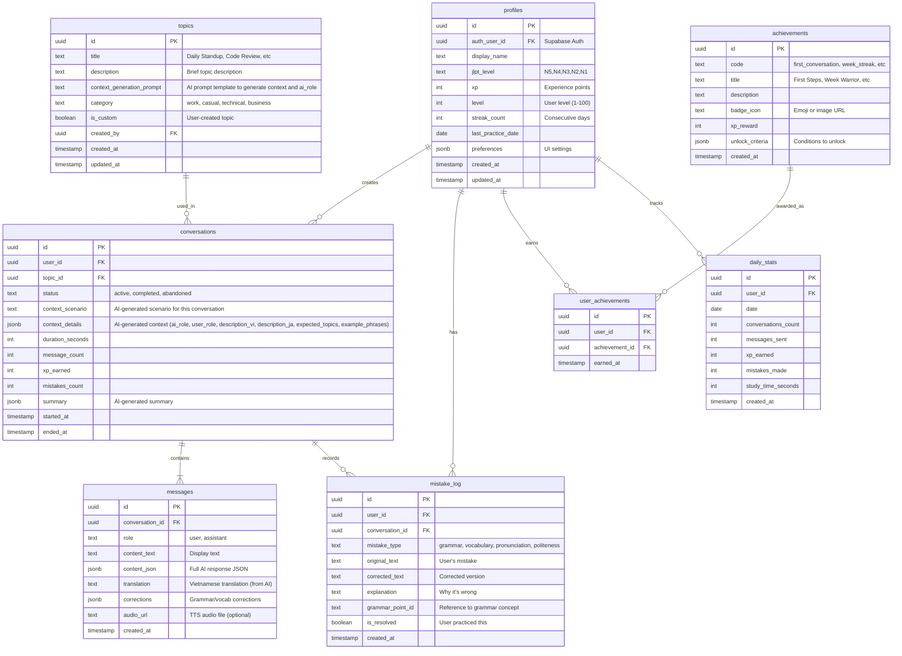

# Entity Relationship Diagram - Hitori Talk

## Database Schema Overview



## Relationships Explained

### 1. User (profiles) → Conversations
- **One-to-Many**: Một user có nhiều conversations
- **Cascade Delete**: Khi xóa user → xóa tất cả conversations của user đó

### 2. Topics → Conversations
- **One-to-Many**: Một topic được sử dụng trong nhiều conversations
- **No Cascade**: Xóa topic không xóa conversations (set topic_id = NULL)

### 3. Conversations → Messages
- **One-to-Many**: Một conversation chứa nhiều messages
- **Cascade Delete**: Xóa conversation → xóa tất cả messages

### 4. User → Mistake Log
- **One-to-Many**: Một user có nhiều mistakes được track
- **Cascade Delete**: Xóa user → xóa mistake log

### 5. Conversation → Mistake Log
- **One-to-Many**: Một conversation có thể có nhiều mistakes
- **Cascade Delete**: Xóa conversation → xóa related mistakes

### 6. User → Achievements
- **Many-to-Many** (through user_achievements)
- Một user có thể unlock nhiều achievements
- Một achievement có thể được unlock bởi nhiều users

### 7. User → Daily Stats
- **One-to-Many**: Một user có daily stats cho mỗi ngày
- **Unique Constraint**: (user_id, date) - mỗi user chỉ có 1 record per day

## Key Design Decisions

### 1. **Unified Message Storage**
```sql
messages {
  content_text TEXT,        -- Display text only
  content_json JSONB,       -- Full AI response {response, corrections, translation}
  translation TEXT,         -- Vietnamese translation (extracted from JSON)
  corrections JSONB         -- Array of corrections (extracted from JSON)
}
```
- **Why?** Flexible storage cho AI responses
- **Trade-off:** Denormalized nhưng faster queries

### 2. **Dynamic Context & Role Generation**
```sql
topics {
  context_generation_prompt TEXT          -- Template for AI to generate context AND ai_role
}

conversations {
  context_scenario TEXT,                  -- AI-generated specific scenario
  context_details JSONB {                 -- AI-generated full context
    ai_role: string,                      -- AI character (generated dynamically)
    user_role: "developer",               -- User always plays developer
    description_vi: string,
    description_ja: string,
    expected_topics: array,
    example_phrases: array
  }
}
```
- **Why?** Maximum flexibility - both context AND ai_role generated per conversation
- **User Role:** Always "developer" (IT professional) for consistency
- **AI Role:** Generated based on scenario for variety
- **Example:** "Code Review" topic generates:
  - Conversation 1: ai_role="senior_developer" reviewing your PR
  - Conversation 2: ai_role="team_lead" reviewing from management perspective
  - Conversation 3: ai_role="peer_developer" doing mutual code review
- **Trade-off:** Extra AI call at conversation start, but maximum variety

### 3. **No Separate Mode Table**
- **Previous design:** Dual modes (natural/correction)
- **Current design:** Unified mode (AI always does all 3 tasks)
- **Result:** Simpler schema, removed mode field from conversations

### 4. **Gamification Tables**
```sql
achievements + user_achievements + daily_stats
```
- **Separation:** Achievement definitions vs user progress
- **Daily Stats:** Aggregate data per day for analytics
- **XP tracking:** Stored in both profiles (total) and daily_stats (daily)

## Indexes Strategy

```sql
-- Performance-critical indexes
CREATE INDEX idx_conversations_user_status ON conversations(user_id, status, created_at DESC);
CREATE INDEX idx_messages_conversation_created ON messages(conversation_id, created_at ASC);
CREATE INDEX idx_mistake_log_user_type ON mistake_log(user_id, mistake_type, created_at DESC);
CREATE INDEX idx_daily_stats_user_date ON daily_stats(user_id, date DESC);
CREATE INDEX idx_user_achievements_user ON user_achievements(user_id, earned_at DESC);
```

## Row Level Security (RLS)

### Profiles
```sql
-- Users can only see/update their own profile
CREATE POLICY "Users can view own profile" ON profiles
  FOR SELECT USING (auth.uid() = auth_user_id);

CREATE POLICY "Users can update own profile" ON profiles
  FOR UPDATE USING (auth.uid() = auth_user_id);
```

### Conversations & Messages
```sql
-- Users can only access their own conversations
CREATE POLICY "Users can view own conversations" ON conversations
  FOR SELECT USING (auth.uid() = (SELECT auth_user_id FROM profiles WHERE id = user_id));

CREATE POLICY "Users can insert own conversations" ON conversations
  FOR INSERT WITH CHECK (auth.uid() = (SELECT auth_user_id FROM profiles WHERE id = user_id));
```

### Topics
```sql
-- All users can view predefined topics
CREATE POLICY "Anyone can view public topics" ON topics
  FOR SELECT USING (NOT is_custom OR created_by = (SELECT id FROM profiles WHERE auth_user_id = auth.uid()));
```

## Future Considerations

### Potential Additions

1. **vocabulary_tracking** table
   ```sql
   CREATE TABLE vocabulary_tracking (
     user_id UUID,
     word TEXT,
     reading TEXT,
     meaning TEXT,
     times_encountered INT,
     times_practiced INT,
     last_seen_at TIMESTAMP
   );
   ```

2. **grammar_points** table
   ```sql
   CREATE TABLE grammar_points (
     id UUID,
     code TEXT UNIQUE,
     title TEXT,
     explanation TEXT,
     jlpt_level TEXT
   );
   ```

3. **study_groups** (social features)
   ```sql
   CREATE TABLE study_groups (
     id UUID,
     name TEXT,
     description TEXT,
     member_count INT
   );

   CREATE TABLE group_members (
     group_id UUID,
     user_id UUID,
     role TEXT  -- admin, member
   );
   ```

---

**Version:** 1.0
**Last Updated:** 2026-03-25
**Status:** Current (reflects Context Setting feature update)
